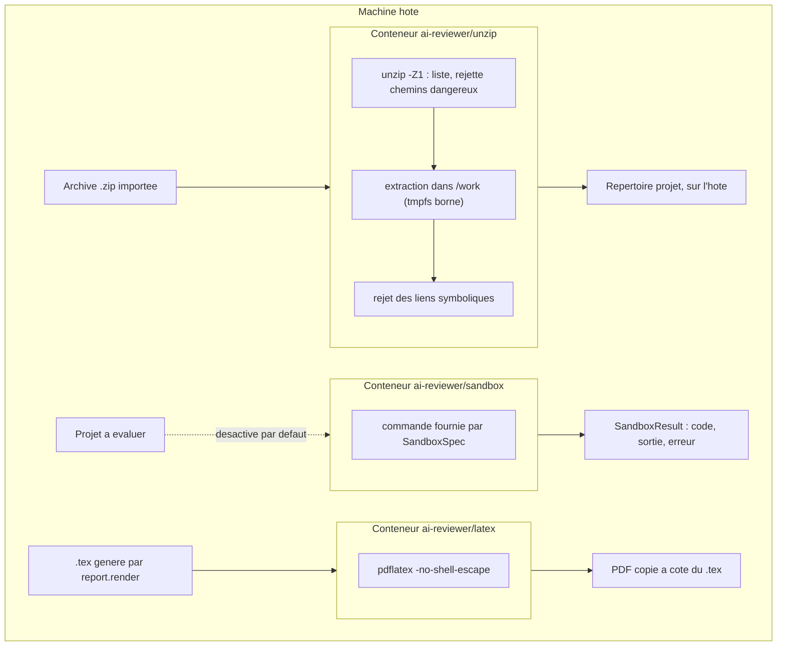

# Securite et isolation Docker

Repond aux points 15 et 16 de la section 13.3 (*securite architecture*, *Docker
isolation*), et sert de source directe pour les questions 19.8 et 19.9 (section
finale de ce document). Perimetre couvert : `security.sandbox`, `security.archive`,
`security.secret`, et la partie `report.compile` qui en depend.

## 1. Menaces considerees

| Menace | Ou elle se manifeste | Parade principale |
|---|---|---|
| Archive malveillante (zip-slip, bombe de decompression, liens symboliques, noms de fichiers hostiles) | Import d'un `.zip` (`project.loader.ArchiveProjectLoader`) | Conteneur `ai-reviewer/unzip`, via `ArchiveExtractor` |
| Code source non fiable | Execution optionnelle du projet evalue | Conteneur `ai-reviewer/sandbox`, **desactive par defaut** |
| Injection de prompt atteignant le rapport | Prose LLM copiee dans le `.tex`, puis compilee | Delimitation + prompt systeme (`llm`), conteneur `ai-reviewer/latex` en defense en profondeur |
| Epuisement de ressources (bombe zip, boucle de compilation, fork bomb) | Les trois conteneurs | Memoire, `pids-limit`, `tmpfs` borne, delai maximal |
| Exfiltration reseau | Les trois conteneurs | `--network none` sans exception |

Ces cinq menaces sont celles que la section 8 et la section 8.2 du cahier des
charges demandent explicitement de traiter et d'expliquer.

## 2. Architecture a trois conteneurs

| Conteneur | Ce qu'il isole | Active par defaut ? |
|---|---|---|
| `ai-reviewer/unzip` | La decompression d'une archive fournie par un autre groupe | Oui : c'est le seul chemin d'import d'archive depuis `ArchiveProjectLoader` |
| `ai-reviewer/sandbox` | L'execution du code du projet evalue | **Non** — `DisabledSandboxRunner` refuse toute execution tant que `sandbox.executionEnabled` n'est pas mis a `true` |
| `ai-reviewer/latex` | La compilation d'un `.tex` contenant de la prose issue du projet evalue | Oui si `report.compilePdf: true` |

Chaque conteneur correspond a une seule interface (`ArchiveExtractor`,
`SandboxRunner`, `PdfCompiler`) et une seule implementation Docker
(`DockerArchiveExtractor`, `DockerSandboxRunner`, `DockerLatexCompiler`). Aucune
autre classe du projet n'invoque `docker` directement — voir section 8.

## 3. Restrictions appliquees, menace par menace

### 3.1 `ai-reviewer/sandbox` (`DockerSandboxRunner`)

| Option | Menace visee |
|---|---|
| `--rm` | Residus d'un conteneur precedent reutilisables par le suivant |
| `--network none` | Exfiltration reseau, telechargement d'un second temps d'attaque |
| `--read-only` | Modification du systeme de fichiers du conteneur lui-meme |
| `--cap-drop ALL` / `--security-opt no-new-privileges` | Elevation de privileges, sortie de conteneur par capacite Linux |
| `--user 1000:1000` (config) | Execution root, acces aux fichiers de l'hote via un bind mal configure |
| `--cpus` / `--memory` / `--pids-limit` | Epuisement CPU/memoire, fork bomb |
| `-v <projet>:/workspace:ro` | Modification du projet analyse ou de fichiers voisins |
| Delai cote Java (`waitFor` + `destroyForcibly`) | Boucle infinie ou calcul volontairement long |
| `LeastPrivilegePolicy.verify(spec)` avant tout lancement | Une specification incomplete ou en root passerait inapercue |

### 3.2 `ai-reviewer/unzip` (`DockerArchiveExtractor`)

| Option / etape | Menace visee |
|---|---|
| `unzip -Z1` puis rejet des noms absolus, `..`, antislash, **avant** extraction | Zip-slip, noms de fichiers malveillants |
| `--tmpfs /work:size=<maxExtractedSizeMb>m` | Bombe de decompression : l'ecriture echoue au niveau systeme de fichiers, pas seulement en verification applicative |
| `maxEntryCount` verifie avant extraction | Bombe de decompression par nombre de fichiers (epuisement d'inodes) |
| `find -type l` apres extraction | Lien symbolique pointant hors du repertoire de sortie |
| `/output` monte `:rw`, seul montage en ecriture ; rien n'y est copie tant que les verifications precedentes n'ont pas reussi | Ecriture partielle ou hors perimetre en cas d'echec |
| `--network none`, `--cap-drop ALL`, `--security-opt no-new-privileges`, `--user`, `--memory`, `--pids-limit` | Memes menaces que 3.1 |

### 3.3 `ai-reviewer/latex` (`DockerLatexCompiler`)

| Option | Menace visee |
|---|---|
| `.tex` monte seul, en lecture seule, plutot que tout le repertoire du rapport | Lecture/ecriture d'autres rapports ou fichiers d'historique par un `pdflatex` compromis |
| Sortie ecrite dans un repertoire temporaire jetable (`-output-directory`), copiee vers le rapport seulement en cas de succes | Un `pdflatex` compromis n'a aucun repertoire reel de l'hote a corrompre |
| `-no-shell-escape` passe explicitement par Java, en plus de l'`ENTRYPOINT` de l'image | Execution de commandes via `\write18`, independamment du contenu exact de l'image |
| `--cap-drop ALL`, `--security-opt no-new-privileges`, `--user`, `--memory`, `--pids-limit`, `--network none` | Memes menaces que 3.1 |
| Delai cote Java, configurable (`latex.timeoutSeconds`) | `.tex` construit pour une compilation pathologiquement longue |
| Journal de compilation capture et masque (`PatternSecretRedactor`) avant d'etre ecrit a cote du `.tex` | Une cle ayant fuite dans la prose generee ne doit pas se retrouver en clair dans un fichier de diagnostic |

## 4. Pourquoi l'execution du projet evalue est desactivee par defaut

Decision journalisee sous `docs/DECISIONS.md#004`. Deux raisons la rendent
**deliberee** et non simplement absente :

1. **L'evaluation n'en a pas besoin.** Le moteur repose sur l'analyse statique
   et le LLM (section 5 et 9) ; aucun critere du profil par defaut n'exige
   d'executer le projet analyse.
2. **Un conteneur reste une frontiere, pas une certitude.** Les restrictions de
   la section 3.1 reduisent fortement le risque d'evasion, elles ne
   l'eliminent pas. Executer du code potentiellement malveillant reste le geste
   le plus dangereux que l'application puisse faire ; il ne doit donc jamais
   etre le comportement par defaut d'un outil que d'autres groupes vont
   installer et lancer sans lire chaque ligne de configuration.

`DisabledSandboxRunner` materialise ce choix dans le type lui-meme : activer
l'execution exige de remplacer explicitement l'implementation injectee (ou de
passer `sandbox.executionEnabled: true`), jamais un simple oubli de
configuration qui laisserait passer une execution par defaut.

## 5. Pourquoi un `.tex` que nous avons genere nous-memes doit rester sous sandbox

Le `.tex` est ecrit par `report.render`, notre propre code. On pourrait donc
croire qu'il n'y a rien a isoler. Ce raisonnement s'arrete a la premiere
etape : le **contenu** du `.tex` est en grande partie de la prose produite par
le LLM a partir du code source du projet evalue (commentaires, noms de
variables, structure) — du texte non fiable par transitivite, echappe pour
LaTeX mais pas neutralise pour autant.

Deux consequences concretes :

- Le mecanisme de defense contre l'injection de prompt (section 8.2,
  delimiteurs + prompt systeme, `llm.prompt`) reduit le risque qu'une consigne
  cachee dans le code influence le *contenu evalue*, mais ne garantit rien sur
  ce que LaTeX *fait* du texte au moment de la compilation.
- `pdflatex` est un moteur avec des primitives d'execution documentees
  (`\write18`, lecture/ecriture de fichiers via `\input`/`\openin`/`\openout`).
  Compiler un `.tex` sans isolation reviendrait, du point de vue du risque, a
  executer directement un fragment du projet analyse — exactement ce que la
  section 8 interdit.

`ai-reviewer/latex` applique donc les memes principes que `ai-reviewer/sandbox`
(section 3.3), avec `-no-shell-escape` verrouille a deux niveaux (image et
commande Java) plutot qu'un seul.

## 6. Limites

- **Pas de second niveau de machine virtuelle.** La section 8 recommande
  VM -> Docker -> projet evalue ; ce projet s'arrete au niveau Docker. Sur
  Windows avec Docker Desktop (moteur WSL2), un niveau de virtualisation existe
  de fait, mais il n'est ni concu ni controle par l'equipe comme la VM dediee
  que demande le sujet : il ne doit pas etre presente comme equivalent en
  soutenance.
- **Noyau partage.** Sans VM dediee, les trois conteneurs et la machine hote
  partagent le meme noyau. Une faille d'evasion de conteneur (Linux ou Docker
  Engine) atteindrait directement l'hote ; aucune des restrictions de la
  section 3 ne s'en protege, seule une VM le ferait.
- **Risque residuel assume.** Ce projet est academique : aucune donnee de
  production ne transite par ces conteneurs, et le temps disponible ne permet
  pas un durcissement au niveau d'un environnement de production (pas de
  `seccomp` personnalise, pas de `gVisor`/`Kata`, pas d'audit de la chaine
  d'approvisionnement des images de base). Ce choix est documente ici plutot
  que laisse implicite.
- **La verification de politique porte sur `SandboxSpec`, pas sur les deux
  autres conteneurs.** `LeastPrivilegePolicy` s'applique a
  `DockerSandboxRunner` uniquement ; `DockerArchiveExtractor` et
  `DockerLatexCompiler` construisent leurs propres commandes `docker run`
  sans passer par un verificateur commun. Fonctionnellement equivalent pour
  l'instant (les trois listes de restrictions sont alignees a la main), mais
  une politique partagee eviterait une divergence future.

## 7. Design Patterns de cette partie

Le sujet penalise explicitement l'usage artificiel d'un pattern (section 14) ;
cette section applique la meme regle que `docs/uml/03-classes-patterns.md` :
ne revendiquer que ce qui resout reellement un probleme de conception.

### Null Object — `DisabledSandboxRunner`, `DisabledArchiveExtractor`, `NoOpPdfCompiler`

**Le probleme resolu.** Trois capacites (executer, extraire, compiler) sont
optionnelles ou peuvent etre indisponibles (Docker absent, execution refusee
par politique). Sans ce pattern, chaque appelant devrait tester une reference
nulle ou intercepter une exception avant d'utiliser le resultat.

**La solution.** Chaque interface (`SandboxRunner`, `ArchiveExtractor`,
`PdfCompiler`) recoit une implementation qui ne fait rien d'actif, mais qui
respecte pleinement le contrat : `DisabledSandboxRunner` refuse via une
exception typee, `DisabledArchiveExtractor` renvoie un `ExtractionResult` de
statut `DOCKER_UNAVAILABLE`, `NoOpPdfCompiler` renvoie `Optional.empty()`.
`GenerateReportUseCase` et le reste de l'application traitent ce cas comme
n'importe quel autre resultat, sans branche speciale.

**Ce qui n'est PAS revendique ici.** Le couple *implementation Docker* /
*implementation desactivee* n'est **pas** qualifie de Strategy, pour la meme
raison que `docs/uml/03-classes-patterns.md` refuse ce nom a
`LLMProvider`/`MockLLMProvider` : ce ne sont pas deux algorithmes
interchangeables pour un meme probleme, mais une implementation reelle et un
refus explicite. Le nommer Strategy serait la qualification artificielle que
la section 14 sanctionne.

## 8. Reponses aux questions de la section 19

### 19.8 — Comment empechez-vous un projet analyse d'endommager la machine ?

Par defaut, il ne s'execute jamais : `DisabledSandboxRunner` refuse toute
execution tant que `sandbox.executionEnabled` n'est pas mis a `true`
explicitement (section 4). L'evaluation elle-meme ne demande jamais cette
execution.

Quand l'execution est activee, et pour les deux autres etapes qui manipulent
du contenu non fiable (import d'archive, compilation du rapport), la meme
recette s'applique dans les trois conteneurs decrits en section 2 et 3 :
conteneur jetable (`--rm`), sans reseau, systeme de fichiers racine en lecture
seule, aucune capacite Linux, utilisateur non root, CPU/memoire/nombre de
processus bornes, delai maximal applique cote Java independamment de Docker,
et au plus un seul montage en ecriture — jamais le projet ou le rapport
complets, toujours un repertoire dedie et jetable.

L'archive elle-meme n'est jamais decompressee en dehors de ce conteneur : ses
noms de fichiers sont valides avant toute ecriture (zip-slip, liens
symboliques), et sa taille decompressee est bornee par le systeme de fichiers
(`tmpfs`), pas seulement par une verification applicative contournable.

### 19.9 — Quels sont les principaux points de couplage de votre architecture ?

**Ou le Docker se couple au reste.** Exactement trois points, chacun derriere
une interface : `SandboxRunner` (execution), `ArchiveExtractor` (extraction),
`PdfCompiler` (compilation). Aucune autre classe n'importe `ProcessBuilder`
pour appeler `docker`, ne connait le nom d'une image, ou ne construit une
commande `docker run`. Remplacer Docker par un autre mecanisme d'isolation
(ou par une doublure de test) est un changement d'implementation, jamais un
changement d'appelant.

**Ce que les interfaces limitent.** Chaque interface expose une seule
operation, centree sur le resultat metier (`ExtractionResult`,
`SandboxResult`, `Optional<Path>`), jamais sur un detail Docker (pas de code
de sortie de conteneur, pas d'image, pas de commande dans les types publics).
`GenerateReportUseCase` et `ArchiveProjectLoader` ne savent pas que leur
dependance est un conteneur.

**Le point de couplage le plus notable, introduit par ce lot de travail.**
`ArchiveProjectLoader` (package `project`) depend desormais de
`ArchiveExtractor` (package `security`) pour deleguer l'extraction — une arete
`project -> security` absente du diagramme original de
`docs/ARCHITECTURE.md`, qui ne fait descendre `security` que depuis
`analysis -> llm`. La dependance reste etroite (une interface, un seul point
d'appel, injectee au constructeur), mais elle merite une validation d'equipe
et une mise a jour du diagramme plutot qu'une correction silencieuse.

**Couplage secondaire.** `report.compile.DockerLatexCompiler` depend de
`security.secret.SecretRedactor` pour masquer le journal de compilation avant
de l'ecrire sur disque — meme constat : une dependance reelle, minimale, mais
non representee dans le diagramme initial.
