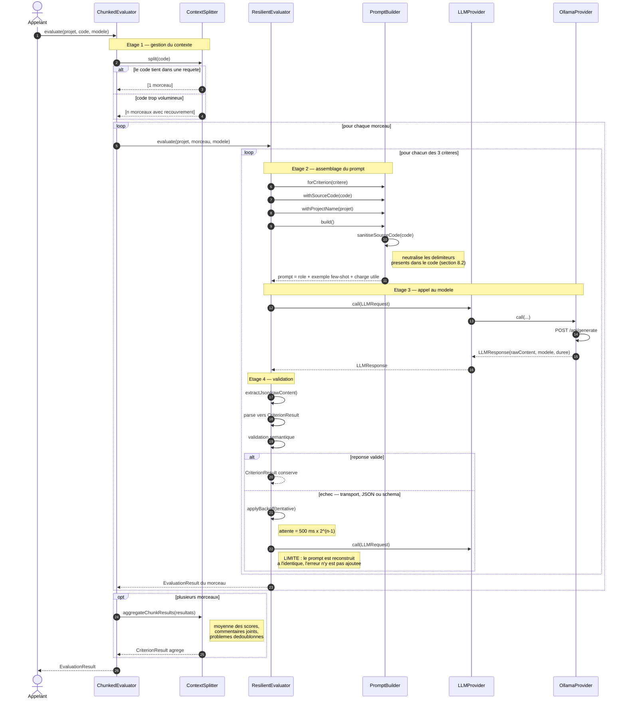

# Diagramme de sequence — evaluation d'un projet

Deroulement reel de `ResilientEvaluator.evaluate(projectName, sourceCode, model)`,
reessais compris.

## Ce que ce diagramme rend visible

**Le nombre d'appels au modele.** Trois criteres multiplies par le nombre de
morceaux : un projet decoupe en dix morceaux declenche trente appels. C'est le
probleme de cout que la section 4.2 demande de traiter (*« eviter les appels
inutiles autant que possible »*), et aucun cache n'intervient ici.

**Le point de neutralisation.** L'appel `sanitiseSourceCode` a lieu dans
`build()`, donc **avant** toute sortie vers le reseau. Aucun chemin ne permet a du
code non fiable d'atteindre le modele sans traverser ce filtre.

**Le moment de l'agregation.** Elle intervient **apres** les appels, sur les
resultats — pas avant, sur le code. C'est l'inverse de ce que montre le schema de
flux existant, qui place l'agregation en amont du prompt.

**La limite du reessai.** Le prompt reconstruit est identique a chaque tentative.
Renvoyer la meme requete a un modele qui vient de mal repondre produit souvent la
meme reponse. Ajouter l'erreur precedente au prompt (« ta reponse n'etait pas un
JSON valide, respecte strictement ce schema ») corrige dans la majorite des cas,
et represente une trentaine de lignes.
