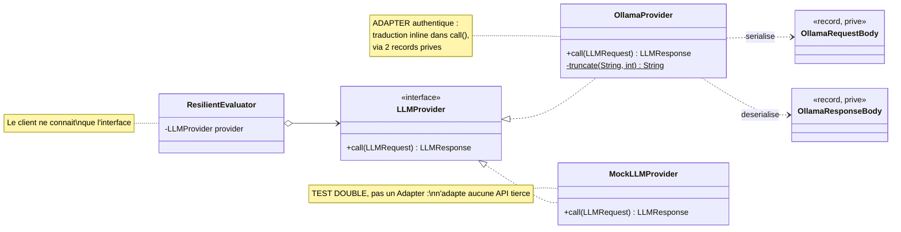

# Diagramme de classes — les Design Patterns isoles

Les sections 6 et 13.3 demandent d'identifier les patterns **et de justifier
chacun**. Ce diagramme isole les deux qui sont structurellement presents dans le
module, verifies sur le code.

## Adapter — uniformiser trois protocoles



**Le probleme resolu.** Chaque fournisseur impose son format JSON, ses noms de
champs, ses codes d'erreur. Sans cet adaptateur, chaque appelant devrait connaitre
le protocole d'Ollama — ce que la section 16.2 sanctionne (*« des appels HTTP au
LLM eparpilles dans l'application »*).

**Ce qui prouve que l'Adapter fonctionne** : les deux records `OllamaRequestBody`
et `OllamaResponseBody` sont **prives**. Le vocabulaire d'Ollama ne franchit pas
la frontiere de la classe.

**Sans ce pattern** : remplacer Ollama par Mistral obligerait a modifier tout code
appelant. Avec, c'est une classe nouvelle.

## Builder — deux usages distincts

```mermaid
classDiagram
    direction TB

    class PromptBuilder {
        -EvaluationCriterion criterion
        -String sourceCode
        -String projectName
        -PromptBuilder(EvaluationCriterion)
        +forCriterion(EvaluationCriterion) PromptBuilder$
        +withSourceCode(String) PromptBuilder
        +withProjectName(String) PromptBuilder
        +build() String
    }
    note for PromptBuilder "Produit : un prompt structure\nen 3 sections (section 4.3)"

    class Config {
        -String baseUrl
        -String defaultModel
        -int timeoutSeconds
        -String format
        -Config(Builder)
        +defaults() Config$
        +builder() Builder$
    }

    class ConfigBuilder {
        -String baseUrl
        -String defaultModel
        -int timeoutSeconds
        -String format
        -Builder()
        +baseUrl(String) ConfigBuilder
        +defaultModel(String) ConfigBuilder
        +timeoutSeconds(int) ConfigBuilder
        +format(String) ConfigBuilder
        +build() Config
    }
    note for ConfigBuilder "Chaque setter valide\nson argument"

    Config +-- ConfigBuilder : classe imbriquee
    ConfigBuilder ..> Config : construit
    OllamaProvider *-- Config
```

**Le probleme resolu, cote prompt.** Un prompt s'assemble en trois parties — role
du modele et schema attendu, exemple few-shot, critere et code — dont certaines
sont optionnelles. Un constructeur a quatre parametres serait illisible et
l'ordre des arguments oubliable.

**Le probleme resolu, cote configuration.** Quatre reglages, tous avec une valeur
par defaut raisonnable. Le Builder permet de n'exprimer que ce qui change, et de
valider chaque valeur au moment ou elle est fournie plutot qu'au premier appel HTTP.

**La preuve que le pattern est correctement implemente** : les deux constructeurs
sont **prives**. Il n'existe aucun moyen d'obtenir un objet partiellement
construit ou invalide.

## Ce qui n'est PAS un pattern dans ce module

| Ce qu'on pourrait croire | Ce que c'est reellement |
|---|---|
`LLMRequest.withDefaults()`, `Config.defaults()` | Methodes de fabrique **statiques** — un idiome Java, pas le pattern Factory |
`MockLLMProvider` | **Test Double** — un pattern de test, non GoF |
Injection de `LLMProvider` au constructeur | **Inversion de dependance** — pas un Strategy : les deux implementations ne sont pas des algorithmes interchangeables, mais un vrai fournisseur et une doublure |
`ResilientEvaluator` enveloppant un provider | **Couche de service** — pas un Decorator, puisqu'il n'implemente pas `LLMProvider` |

Le code annote `PATTERN: Strategy` a cinq endroits. Cette qualification est
fragile : le sujet previent en gras que *« l'utilisation artificielle d'un Design
Pattern sera penalisee »*. Mieux vaut revendiquer deux patterns solides que
quatre discutables.
